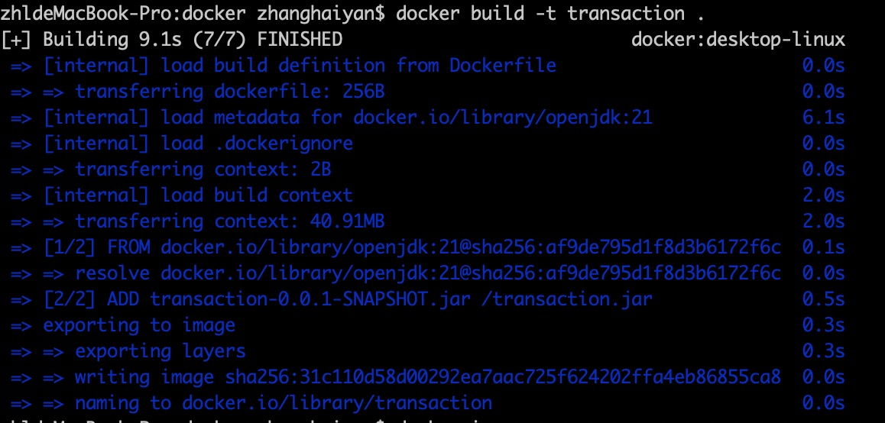
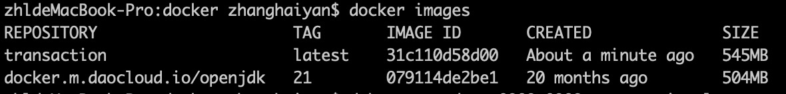
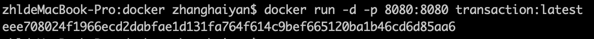
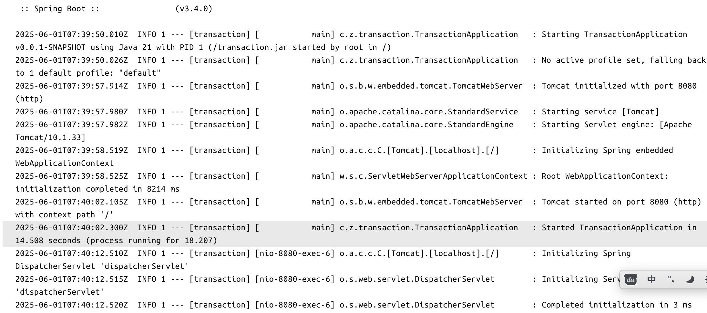

### 项目说明
    1. 数据存在内存中，使用ConcurrentHashMap实现线程安全的数据存储
    2. 缓存机制：通过spring Cache整合caffeine实现交易数据缓存，提升更新和删除时交易查询性能
    3. 完整的异常处理：实现全局异常处理器，同一返回标准错误响应格式
### 打包命令
mvn clean install -Dmaven.test.skip=true
### dockerfile文件
Dockerfile
### 部署docker步骤
#### 1. 将打包生成的jar包**transaction-0.0.1-SNAPSHOT.jar**和**Dockerfile** 上传的容器同一目录下
#### 2. 执行脚本构建镜像
    docker build -t transaction .
结果如图：
#### 3. 镜像构建成功后，查看docker下的容器
    docker images
结果如图：
#### 4. 运行docker镜像
    docker run -d -p 8080:8080 transaction:latest
结果如图：
服务启动成功：

### 功能验证
#### 1. 创建交易
##### 1.1 接口信息
| 接口信息 |                                    |
|------|------------------------------------|
| 请求地址 | http://127.0.0.1:8080/createTransaction |
| 请求方式 | POST                               |

##### 1.2 请求参数
| 参数名称 | 参数类型   | 参数含义        | 是否必填 |
|------|--------|-------------|------|
| type | String | 交易类型        | 是    |
| amount | String | 交易金额（必须是数字） | 是    |
| transactionAccount | String | 交易账户        | 是    |
| transactionTargetAccount | String | 交易目标账户      | 否    |

```json
{
    "type":2,
    "amount":"1",
    "transactionAccount":"A",
    "transactionTargetAccount": "B"
}
```
##### 1.3 请求出参
| 参数名称                     | 参数类型   | 参数含义   | 
|--------------------------|--------|--------|
| status                   | String | 状态码    | 
| errorMsg                   | String | 错误信息   |
| data       | Object | 交易账户Id | 

```json
{
  "status": "200",
  "errorMsg": null,
  "data": "716932842386493440"
}
```

#### 2. 更新交易
##### 2.1 接口信息
| 接口信息 |                                    |
|------|------------------------------------|
| 请求地址 | http://127.0.0.1:8080/modifyTransaction |
| 请求方式 | POST                               |

##### 2.2 请求参数
| 参数名称 | 参数类型    | 参数含义        | 是否必填 |
|------|---------|-------------|-----|
| transactionId | Long    | 交易ID        | 是   |
| type | String  | 交易类型        | 是   |
| amount | String  | 交易金额（必须是数字） | 是   |
| transactionAccount | String  | 交易账户        | 是   |
| transactionTargetAccount | String  | 交易目标账户      | 否   |
| lastUpdateVersion | Integer | 当前版本        | 是   |

```json
{
  "transactionId":716938382206439424,
  "type": 1,
  "amount": "20",
  "transactionAccount": "A",
  "lastUpdateVersion":0
}
```
##### 2.3 请求出参
| 参数名称                     | 参数类型   | 参数含义 | 
|--------------------------|--------|------|
| status                   | String | 状态码  | 
| errorMsg                   | String | 错误信息 |
| data       | Object | 交易信息 | 

```json
{
  "status": "200",
  "errorMsg": null,
  "data": {
    "transactionId": 716938382206439424,
    "type": "1",
    "amount": 20,
    "transactionTime": "2025-06-01T16:57:10.3895806",
    "transactionAccount": "A",
    "transactionTargetAccount": null,
    "lastUpdateVersion": 0,
    "updateTime": null,
    "uniqueKey": "1_20_A"
  }
}
```

#### 3. 删除交易
##### 3.1 接口信息
| 接口信息 |                                                         |
|------|---------------------------------------------------------|
| 请求地址 | http://127.0.0.1:8080/removeTransaction/{transactionId} |
| 请求方式 | GET                                                     |

##### 3.2 请求出参
| 参数名称                     | 参数类型   | 参数含义                   | 
|--------------------------|--------|------------------------|
| status                   | String | 状态码                    | 
| errorMsg                   | String | 错误信息                   |
| data       | Object | 删除结果（true:成功 false:失败） | 

```json
{
  "status": "200",
  "errorMsg": null,
  "data": true
}
```

#### 4. 交易分页查询
##### 4.1 接口信息
| 接口信息 |                                                      |
|------|------------------------------------------------------|
| 请求地址 | http://127.0.0.1:8080/queryTransactionsByPagingQuery |
| 请求方式 | POST                                                 |

##### 4。2 请求入参
| 参数名称                     | 参数类型    | 参数含义   | 
|--------------------------|---------|--------|
| pageSize                   | Integer | 每页展示条数 | 
| pageNumber                   | Integer  | 页码     |

```json
{
  "pageSize":1,
  "pageNumber":3
}
```
##### 4。3 请求出参
| 参数名称                     | 参数类型   | 参数含义      | 
|--------------------------|--------|-----------|
| status                   | String | 状态码       | 
| errorMsg                   | String | 错误信息      |
| data       | Object | 每页展示的交易记录 | 

```json
{
  "status": "200",
  "errorMsg": null,
  "data": {
    "content": [
      {
        "transactionId": 716942204840579072,
        "type": "2",
        "amount": 1,
        "transactionTime": "2025-06-01T17:12:21.7763304",
        "transactionAccount": "A",
        "transactionTargetAccount": null,
        "lastUpdateVersion": 0,
        "updateTime": null,
        "uniqueKey": "2_1_A"
      }
    ],
    "page": {
      "size": 3,
      "number": 3,
      "totalElements": 10,
      "totalPages": 4
    }
  }
}
```

### 单元测试
    src/test/java/com/zhl/transaction/service/TransactionServiceTest.java
### 功能演示
    视频路径：video/演示.mp4
### 压力测试
    jmeter脚本：src/test/交易测试.jmx